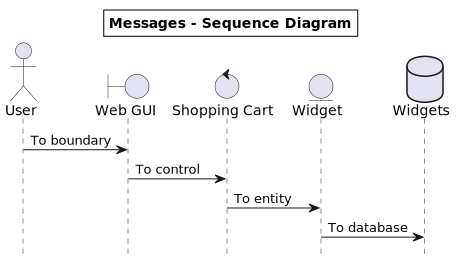

# Hello world in C

## Introduction

This is an example hello world C program.
We can define codeblocks with `---`

Some example flow diagram:



```c
--- hello.c
@{Include files}
@{The main function}
---
```

some text.

```c
--- The main function
int main()
{
	@{Print a string}
	return 0;
}
---
```

Now we can define the `Includes` codeblock:

```c
--- Include files
#include <stdio.h>
---
```

Finally, our program needs to print "hello world"

```c
--- Print a string
printf("Hello, world!\n");
---
```

## Compiling and running

```sh
--- compile.sh
#!/bin/sh

gcc hello.c -o hello
---
```

to run : just enter command <font color=red>`sh run.sh`</font> to run.

```sh
--- run.sh
#!/bin/sh

sh ./compile.sh

./hello
---
```

## Testing
Should show an output that looks like this:

<center>

</center>

## Deploying 
Just copy the `hello` file and run it!

OR run the command:

$ <font color=red>`sh run.sh`</font>
