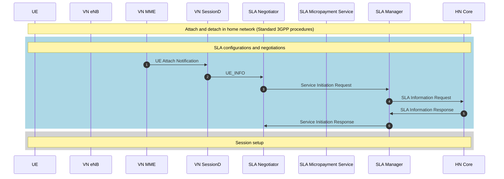

```mermaid
sequenceDiagram

    autonumber

    participant ue as UE
    participant enb as VN eNB
    participant mme as VN MME
    participant s as VN SessionD 
    participant n as SLA Negotiator 
    participant m as SLA Micropayment Service 
    participant mgr as SLA Manager
    participant core as HN Core

    note over ue, core : Attach and detach in home network (Standard 3GPP procedures)

    rect lightblue
        note over ue, core: SLA configurations and negotiations 
        mme ->> s : UE Attach Notification 
        s ->> n : UE_INFO 
        n ->> mgr : Service Initiation Request
        mgr ->> core : SLA Information Request
        core ->> mgr : SLA Information Response
        mgr ->> n : Service Initiation Response
    end

    rect lightgray
        note over ue, core: Session setup 
    end
```