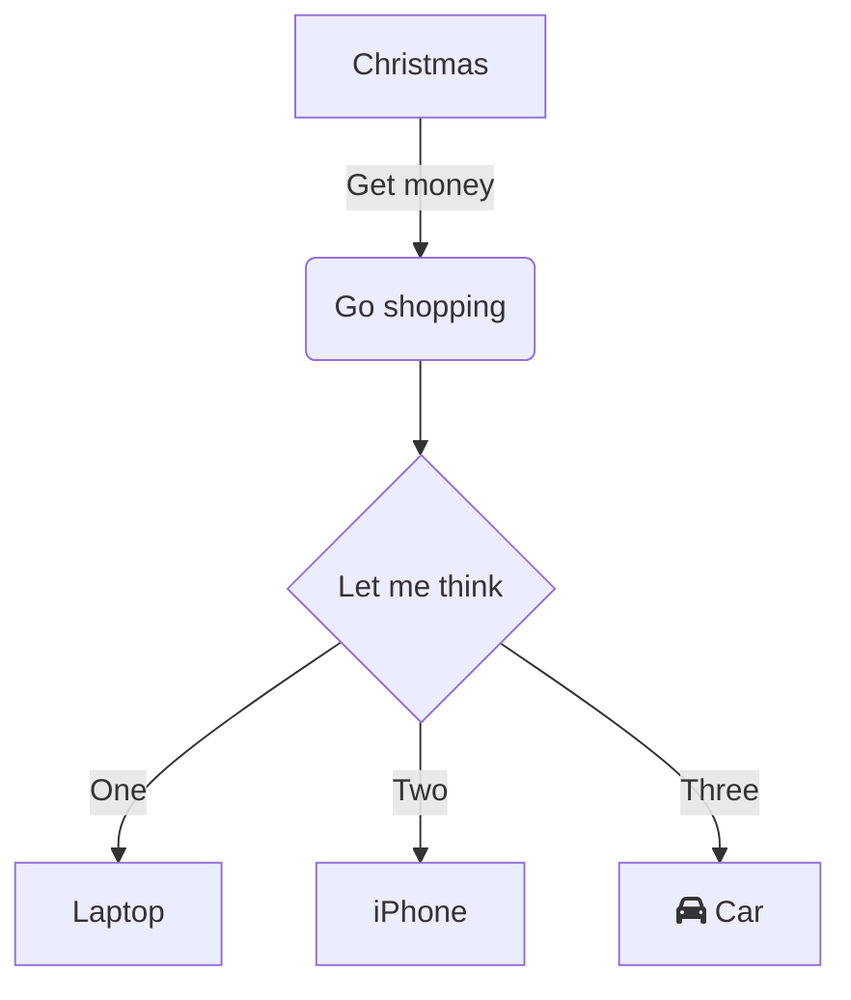

# Testing 

## Introduction

This is an example hello world C program.
We can define codeblocks with `---`



```py
--- hangman.py +=
sys.exit(-1) ...............................................................................................................................................................
---
```

```py
--- test.py
import random
import sys

print "Welcome to hangman!"

@{Hangman / Setup}

lives_left = 8

while lives_left > 0:
#
    @{Hangman / Take user input}
    @{Hangman / Check input}
    @{Hangman / Check win}
#

@{End}
---
```

```py
--- End
print "You lose. The word was " + secret_word
@{x}
---
```

## end
### subsection test

```py
--- x
print("hello world")
---
```
